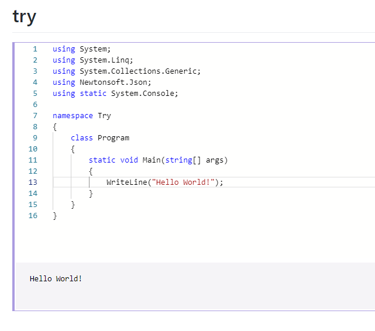

# Dotnet Try

This is a repository for a C# playground in your browser, using [dotnet try](https://github.com/dotnet/try)

# Getting started

1. Install [dotnet core 3.x](https://dotnet.microsoft.com/download)

1. Clone this repository

1. If you're on linux or OS X, run `add_dotnet_try.sh`. If you're on Windows, run `add_dotnet_try.ps1`. This will add `dotnet try` as a [dotnet global tool](https://docs.microsoft.com/en-us/dotnet/core/tools/global-tools)

1. If you're on linux or OS X, run `start.sh`. If you're on Windows, run `start.ps1`. This will startup the dotnet try application, and open your browser.

1. This will use `./Try/Try.csproj` as a starter, and run your code in that context. By default, dotnet core 3.0 is used as the runtime, with [Newtonsoft.Json](https://www.newtonsoft.com/json) as a dependency. If you want to add dependencies, or change the default project, just edit `./Try/Try.csproj`, or `./Try/Program.cs`
